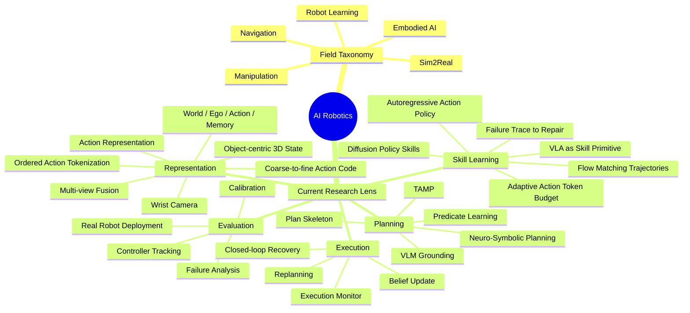

# Research Lens、Research Map 与 Actionable Ideas

当论文任务需要连接用户当前研究兴趣、检查 research map 或形成 ideas 时完整阅读本文件。每篇论文仍需执行轻量级 Research Map Check。

## 目录

1. 动态 Research Lens
2. 研究兴趣连接
3. Research Map Check
4. Actionable Ideas
5. Mindmap 处理

## 3. 动态 Research Lens

不要把用户的研究兴趣永久硬编码。

写论文笔记前，要从以下来源推断当前 research lens：

1. 用户当前 prompt，尤其是“我关注的问题”；
2. Zotero 中近期 `Research Idea | ...` child notes；
3. Zotero 中近期高优先级或最近精读的论文、Research Memo PDFs 和 tags；
4. 用户明确提供的 Current Research Lens；
5. AI Robotics mindmap，如果可见或可访问。

常见 lens 包括：

- neuro-symbolic planning；
- TAMP 与 perception-to-planning interface；
- object-centric world state；
- world / ego / action / memory 解耦；
- VLA vs planning；
- VLA as reactive skill primitive；
- multi-view 和 wrist-camera representation；
- action representation；
- closed-loop execution monitor；
- belief update 和 replanning；
- failure trace to repair policy；
- real robot deployment、calibration、controller tracking。

这个 lens 应随用户近期兴趣变化。不要假设用户永远只关注同一批主题。

---

---

### 8.9 和用户当前研究兴趣的连接

只有在有意义时，才把论文连接到用户的 research lens。不要强行联系。

常见连接方式：

- 如果论文结构化 action，讨论它和 action distribution、motion primitive、low-level abstraction、planning interface 的关系；
- 如果论文结构化 observation / state，讨论它和 world / ego / memory 分离的关系；
- 如果论文使用 token，讨论 token order 是帮助 planning，还是只帮助 prediction；
- 如果论文使用 coarse-to-fine 预测，讨论它能否支持 hierarchical planning；
- 如果论文使用 language，判断它是真 symbolic，还是 language-conditioned imitation；
- 如果论文使用 diffusion / flow / autoregressive modeling，比较 representation 和 inference trade-off；
- 如果论文涉及 multi-view / wrist camera，判断它是否真的建模 correspondence，还是只是简单 concat。

### 8.10 Research Map Check

每篇论文都要做轻量级 research-map update check，但不要自动重写用户 mindmap。

格式：

```markdown
## Research Map Check

### Connects to existing nodes
- ...

### Candidate new keywords
- ...

### Should update main mindmap?
建议：不更新 / 小更新 / 值得更新

理由：
...

### Suggested Mermaid patch
如果建议更新，给出一个小的 Mermaid patch 或 node list。
```

只有至少满足以下条件之一时，才建议更新主 mindmap：

1. 这个概念在多篇近期高价值论文中反复出现；
2. 它可以变成一个具体实验方向；
3. 它和近期 idea child notes 强相关；
4. 它改变了用户对某个主要研究方向的理解；
5. 它是可迁移研究问题，而不是某一篇论文的方法名。

不要因为一次性 model name、临时 demo 细节、泛泛 related-work 术语、过窄 component name、没有实验路径的想法建议更新。

好的候选节点示例：Ordered Action Tokenization、Coarse-to-fine Action Representation、Action Token Budget、Prefix-decodable Policy、Perception-to-Planning Interface、Object-centric World State、Predicate Effect Monitor、VLA as Reactive Skill Primitive、Closed-loop Execution Recovery、Multi-view Correspondence、Wrist-view Local Refinement、Belief-space TAMP、Failure Trace to Repair Policy。

### 8.11 Actionable Ideas

只创建高质量想法，不要强迫每篇论文都生成很多 idea。

一个想法只有在至少满足以下条件之一时，才应写成 Zotero `Research Idea | <title>` child note：

1. 可以转化为具体实验；
2. 和当前 research lens 强相关；
3. 可以成为项目分支；
4. 很快可以作为 baseline / ablation 使用；
5. 是一个反复出现但未解决的研究问题。

否则，把它作为 paper memo 里的短 note，不要污染 Zotero notes。

想法类型使用：Seed Question、Experiment Idea、Project Direction、Paper-level Idea、Baseline / Ablation Idea。

如果写入 Zotero idea child note，包含：想法标题、类型、来源论文与精确证据锚点、研究问题、motivation、具体实验设计、需要的系统 / 数据 / 代码、metrics、预期结果、可能失败原因、优先级、和当前 Research Lens 的关系。

---

## 11. Mindmap 处理

当前 mindmap 可能偏宽泛、像 field taxonomy。不要假设它完全反映当前兴趣。

区分三层：

1. **Field Map**

   稳定的大领域分类：Robot Learning、Embodied AI、Manipulation、Navigation、Sim2Real。

2. **Current Research Lens**

   动态个人研究视角：representation、planning、action、memory、closed-loop recovery、VLA-planning interface。

3. **Update Candidates**

   近期论文提出的临时候选概念。

提出 mindmap 更新时，优先添加到 Current Research Lens，而不是让 broad Field Map 膨胀。

可能的目标结构：



没有用户明确同意，不要覆盖现有 mindmap。

---
